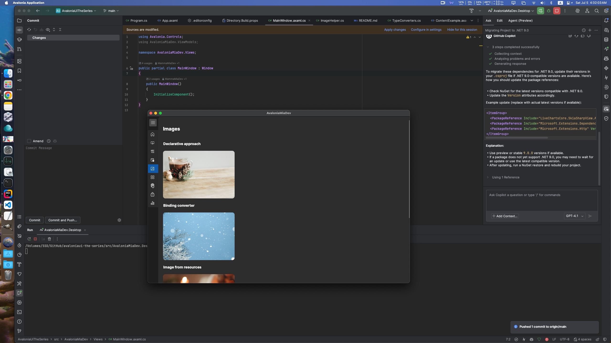

# AvaloniaUI The Series — Enhanced for macOS
#### forked from MammaMiaDev/avaloniaui-the-series

## main changes
- improved ViewLocator to generic;
- removed unnecessary design for mainwindow ctor;
- used GetExecutingAssembly instead of GetEntryAssembly, so to support cross-platform;
- migrated to Avalonia 11.1.5;
- migrated to .NET 9.0 so fixed bug: mainwindow cannot minimize on macOS;

--below from origin author
## avaloniaui-the-series
Codebase for the [Avalonia series](https://www.youtube.com/playlist?list=PLJYo8bcmfTDF6ROxC8QMVw9Zr_3Lx4Lgd) application on YouTube.
